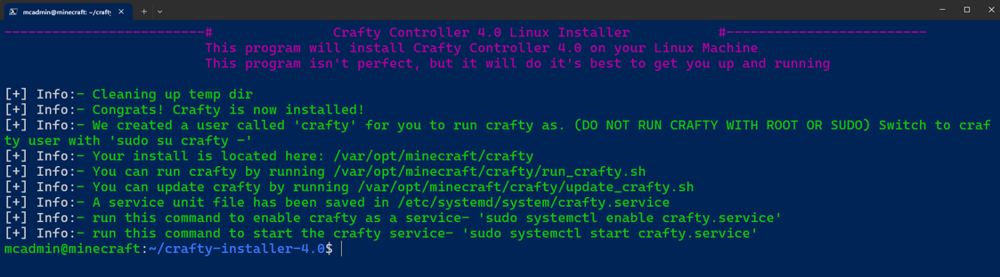

# Minecraft Server
## Summary
Pre-req: [01-proxmox](../01-proxmox/README.md)

Virtual Machine: Ubuntu
Software:
- **Crafty Controller**: used to manage one or more Minecraft servers running on the one server/VM
- **playit.gg**: a service that allows you to expose your server to the Internet so its joinable by friends outside your LAN

## Install Guide
### Download Ubuntu Server ISO
- Open Proxmox management
- Select the local storage of the node/host
- Open ISO Images
- Select Download from URL
- Ubuntu ISO: https://releases.ubuntu.com/24.04.2/ubuntu-24.04.2-live-server-amd64.iso (Check [Ubuntu Downloads](https://ubuntu.com/download/server#manual-install))

### Create VM
- In Proxmox, select Create VM (top of screen)
- Fill out the settings in each tab
  - General
    - VM ID: 100
    - Name: minecraft
  - OS
    - ISO image: ubuntu-24.04.2-life-server-amd64.iso
    - Guest OS Type: Linux
  - Disks, CPU & Memory
    - As desired
  - Network
    - Bridge: vmbr0
    - VLAN Tag: 300
- Select the VM in proxmox, then choose Options
- Edit QEMU Guest Agent and set to Enabled

### Configure OS
- Install updates, git, openssh & proxmox guest agent:
  ```
  sudo apt update && sudo apt upgrade && sudo apt install git 
  sudo apt get openssh-server
  apt-get install qemu-guest-agent
  sudo systemctl enable qemu-gueset-agent
  sudo timedatectl set-timezone Australia/Brisbane
  sudo shutdown
  ```
- May need to stop VM from Proxmox, then power back on for Guest Agent to be applied
- Verify
  - From VM summary in Proxmox that Guest Agent is running
  - That you can launch SSH to the server from your PC
  ```
  PowerShell:
  ssh mcadmin@192.168.30.30
  ```

### Install Crafty Controller
Refer: https://docs.craftycontrol.com/pages/getting-started/installation/linux/
- One liner:
  ```
  git clone https://gitlab.com/crafty-controller/crafty-installer-4.0.git && \
  cd crafty-installer-4.0 && \
  sudo ./install_crafty.sh
  ```
  
- Run Crafty as a service, and start it
  ```
  sudo systemctl enable crafty.service
  sudo systemctl start crafty.service
  ```
- From PC, visit Crafty admin portal https​://192.168.30.30:8443

### Create a Minecraft Server
- You're best following this fantastic guide: https://youtu.be/bAGTwBURBXc?si=f2uN_HEQ6oeYRw6D&t=1196

### playit.gg Agent
- Sign-up for playit.gg: https://playit.gg
- Add a new agent, follow the Linux instructions
   ```
   curl -SsL https://playit-cloud.github.io/ppa/key.gpg | gpg --dearmor | sudo tee /etc/apt/trusted.gpg.d/playit.gpg >/dev/null
   echo "deb [signed-by=/etc/apt/trusted.gpg.d/playit.gpg] https://playit-cloud.github.io/ppa/data ./" | sudo tee /etc/apt/sources.list.d/playit-cloud.list
   sudo apt update
   sudo apt install playit
   ```
- Run playit agent once to get the binding code
  ```
  playit setup
  ```
- Visit the link provided to bind the agent to your playit.gg account and create the tunnel
- Configure playit to run as a service
  ```
  sudo systemctl enable playit.service
  sudo systemctl start playit.service
  systemctl status playit.service
  ```
- Once complete you'll find the link that you can provide to players outside of your LAN. Mine ended in '.joinmc.link' suffix as I'm on the free tier

## References
Thanks to the following inspiration:

- [Hardware Haven](https://www.youtube.com/@HardwareHaven): EASY Budget Minecraft Servers With Crafty https://www.youtube.com/watch?v=bAGTwBURBXc
