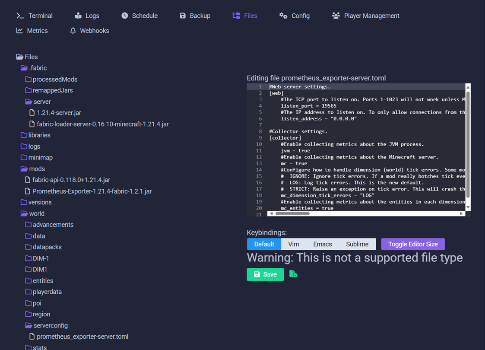

# Grafana Monitoring & Alerting
## Summary
I wanted to receive a push notification on my mobile phone whenever someone joined the server. I over-engineered the solution and ended up with great monitoring & performance insights using Grafana Cloud.

## Contents
1. [Grafana Cloud](#grafana-cloud)
2. [Cloud endpoints & APIs](#cloud-endpoints--apis)
3. [Prometheus Exporter for Minecraft](#prometheus-exporter-for-minecraft)
4. [Alloy agent](#alloy-agent)
5. [Dashboards](#dashboards)
6. [Contact points](#contact-points)
7. [Notification policies](#notification-policies)
8. [Alert rules](#alert-rules)
9. [OnCall notifications](#oncall-notifications)
10. [IRM Mobile App](#irm-mobile-app)

## Install Guide
### Grafana Cloud
- Sign-up to the free tier of Grafana Cloud: https://grafana.com/products/cloud/
  - Explore the free tier inclusions: https://grafana.com/pricing/

### Cloud endpoints & APIs
- From Grafana Cloud, visit the "Manage subscription" link from the home page (in Account plan section) https​://grafana.com/orgs/{your-org-name}/subscription
- From the left menu, choose the "stack" (name of your instance in the "Grafana Cloud" section)
- Loki (logs)
  - Find **Loki** and select "Details" button
  - Find "Sending Logs to Grafana Cloud using Grafana Alloy"
  - Take note of the URL and the username
  - Click "Generate now" to generate an API token with permission to upload logs
- Prometheus (metrics)
  - Find **Prometheus** and select "Details" button
  - Find "Sending metrics using Grafana Alloy"
  - Take note of the URL and the username
  - Click "Generate now" to generate an API token with permission to upload logs 

### Prometheus Exporter for Minecraft
- Download: https://www.curseforge.com/minecraft/mc-mods/prometheus-exporter. In my case, I also needed Fabric API
- Copy to the server
  ```
  scp .\downloads\Prometheus-Exporter-1.21.4-fabric-1.2.1.jar mcadmin@192.168.30.30:/home/mcadmin
  scp .\downloads\fabric-api-0.118.0+1.21.4.jar mcadmin@192.168.30.30:/home/mcadmin/
  ```
- SSH to the server
- Note the path to your Minecraft server's mod folder
  ```
  ls -l /var/opt/minecraft/crafty/crafty-4/servers
  ```
- Save the mod to Minecraft folder and set permissions for crafty user to have access (replace the GUID )
  ```
  cd /var/opt/minecraft/crafty/crafty-4/servers/{server-id}/mods
  
  sudo cp ~/Prometheus-Exporter-1.21.4-fabric-1.2.1.jar Prometheus-Exporter-1.21.4-fabric-1.2.1.jar
  sudo chown crafty:crafty Prometheus-Exporter-1.21.4-fabric-1.2.1.jar

  sudo cp ~/fabric-api-0.118.0+1.21.4.jar fabric-api-0.118.0+1.21.4.jar
  sudo chown crafty:crafty fabric-api-0.118.0+1.21.4.jar

  ```
- Restart Minecraft server in Crafty
- A default config file will be created, with default port of 19565
  ```
  cat /var/opt/minecraft/crafty/crafty-4/servers/{server-id}/serverconfig/prometheus_exporter-server.toml
  ```
  


### Alloy agent
Refer: https://grafana.com/docs/alloy/latest/tutorials/send-logs-to-loki/

- SSH to the server
- Run install scripts
  ```
  sudo apt install gpg

  wget -q -O - https://apt.grafana.com/gpg.key | gpg --dearmor | sudo tee /etc/apt/keyrings/grafana.gpg > /dev/null
  echo "deb [signed-by=/etc/apt/keyrings/grafana.gpg] https://apt.grafana.com stable main" | sudo tee /etc/apt/sources.list.d/grafana.list

  sudo apt-get update
  sudo apt-get install alloy
  ```
- Create a file to host the endpoints & credentials, replacing URL & username with the required values (don't add passwords yet)
    ```
    cat > ~/endpoints.json << EOF
    {
        "metrics": {
            "url": "https://metrics-url.grafana.net/api/prom/push",
            "basicAuth": {
                "username": "user-id",
                "password": "api-key"
            }
        },
        "logs": {
            "url": "https://logs-url.grafana.net/loki/api/v1/push",
            "basicAuth": {
                "username": "user-id",
                "password": "api-key"
            }
        }
    }
    EOF
    ```
- Copy endpoints file to the required location
  ```
  sudo cp endpoints.json /etc/alloy/endpoints.json
  ```
- Add passwords to the file in its secured location
  ```
  sudo vi /etc/alloy/endpoints.json
  ```
- Create the config file (change server-id value)
  ```
    cat > ~/config.alloy << EOF
    // Configuration file
    local.file "endpoints" {
        // The endpoints file is used to define the endpoints, credentials and options
        // for the Alloy export to.
            filename = "/etc/alloy/endpoints.json"
    }

    // The Alloy exports everything, using an empty block.
    prometheus.exporter.unix "default" {}

    // This component scrapes the Unix exporter metrics generated above.
    prometheus.scrape "unix" {
        // Use the Unix prometheus exporter as the target.
        targets = prometheus.exporter.unix.default.targets
        // Send the metrics to the prometheus remote write receiver for exporting to Prometheus.
        forward_to = [prometheus.remote_write.grafanacloud.receiver]
        // Attach job name to the metrics.
        job_name = "node_exporter"
    }

    prometheus.scrape "minecraft" {
        // Collect metrics from the default listen address for Prometheus Exporter Mod.
        targets = [{
            __address__ = "127.0.0.1:19565",
        }]

        forward_to = [prometheus.remote_write.grafanacloud.receiver]
    }

    prometheus.remote_write "grafanacloud" {
        endpoint {
            url = json_path(local.file.endpoints.content, ".metrics.url")[0]

            // Get basic authentication based on environment variables.
            basic_auth {
                username = json_path(local.file.endpoints.content, ".metrics.basicAuth.username")[0]
                password = json_path(local.file.endpoints.content, ".metrics.basicAuth.password")[0]
            }
        }
    }

    local.file_match "local_files" {
        path_targets = [{"__path__" = "/var/opt/minecraft/crafty/crafty-4/servers/{server-id}/logs/latest.log"}]
        sync_period = "5s"
    }

    loki.source.file "log_scrape" {
        targets    = local.file_match.local_files.targets
        forward_to = [loki.write.grafana_loki.receiver]
        tail_from_end = true
    }

    loki.write "grafana_loki" {
        external_labels = {
            service_name = "minecraft01",
        }
        endpoint {
            url = json_path(local.file.endpoints.content, ".logs.url")[0]

            basic_auth {
                username = json_path(local.file.endpoints.content, ".logs.basicAuth.username")[0]
                password = json_path(local.file.endpoints.content, ".logs.basicAuth.password")[0]
            }
        }
    }
    EOF
  ```
- Copy config file to its location
  ```
  sudo cp config.alloy /etc/alloy/config.alloy
  ```
- Set Alloy to run as a service, and start it
  ```
  sudo systemctl enable alloy.service
  sudo systemctl start alloy
  ```
- Check its running successfully
  ```
  sudo journalctl -u alloy
  ```
- In Grafana, check that the logs and metrics are being received

### Dashboards
- Open Grafana, navigate to Dashboards
- New > Import
  - Minecraft Server: https://grafana.com/grafana/dashboards/16508-minecraft-server-stats/
  - Ubuntu Host/Node: https://grafana.com/grafana/dashboards/1860-node-exporter-full/

### Contact points
- Open Grafana
- Navigate to Alerting > Contact Points
- Create #1
  - Name: IRM 01 Player Events
  - Integration: Grafana OnCall
  - Integration Name: IRM 01 Player Events
  - Notification Settings: Disable resolved messages = checked
- Create #2
  - Name: IRM 02 Server Events
  - Integration: Grafana OnCall
  - Integration Name: IRM 02 Server Events
  - Notification Settings: Disable resolved messages = checked
- Create #3
  - Name: IRM 03 Metrics
  - Integration: Grafana OnCall
  - Integration Name: IRM 03 Metrics

### Notification policies
- Navigate to Alerting > Notification Policies
- Under Default, create new child policy
- Policy #1
  - Label: alertname
  - Operator: =~ Regex
  - Value: Player Event
  - Contact Point: IRM 01
- Policy #2
  - Label: alertname
  - Operator: =~ Regex
  - Value: Server Event
  - Contact Point: IRM 02
- Policy #3
  - Label: alertname
  - Operator: =~ Regex
  - Value: Metrics
  - Contact Point: IRM 03

### Alert rules
- Navigate to Alerting > Alert rules
- New
  - #1 Name: Player Event - Joined
  - #2 Query Source: Loki
  - Query
    ```
    sum by (player)(count_over_time({service_name=`minecraft01`} |= `joined the game` | pattern `<time> [<server>/<level>]: <player> <_>` [1m]))
    ```
  - Options > set time range now-1m to now
  - Alert condition: When Mean of query > 0
  - #3 Choose folder
  - Add label
    - Key: verb
    - Value: joined the game
  - #4 Evaluation behaviour
    - Pending period: None / 0 seconds
    - Alert state if no data = Normal
  - #5 Notifications
    - Contact Point: IRM 01 Player Events
- Repeat for the x3 other logging alerts:

| Name                  | Query                | Verb Label | Contact Point |
|-----------------------|----------------------|------|---------|
| Player Event - Joined | sum by (player)(count_over_time({service_name=\`minecraft01\`} \|= \`joined the game\` \| pattern \`\<time\> \[\<server\>\/\<level\>\]: \<player\> <_>` \[1m\])) | joined the game | IRM 01 |
| Player Event - Left | sum by (player)(count_over_time({service_name=\`minecraft01\`} \|= \`left the game\` \| pattern \`\<time\> \[\<server\>\/\<level\>\]: \<player\> <_>` \[1m\])) | left the game | IRM 01 |
| Server Event - Started | sum by (message)(count_over_time({service_name=\`minecraft01\`} \|= \`Starting minecraft server version\` \| pattern \`\<message\>\` \[1m\])) | started | IRM 02 |
| Server Event - Stopping | sum by (message)(count_over_time({service_name=\`minecraft01\`} \|= \`Stopping the server\` \| pattern \`\<message\>\` \[1m\])) | stopping | IRM 02 |

- Configure metric alert
  - #1 Name: Metrics - Down Detection
  - #2 Query Source: Prometheus
    - Metric: up
    - Label filters: instance = 127.0.0.1:19565
  - Alert condition: when query below 1
  - #3 Choose folder
  - #4 Evaluation behaviour
    - Pending period: 5 minutes
    - Alert state if no data = Alerting
  - #5 Notifications
    - Contact Point: IRM 03 Metrics

### OnCall notifications
- Create Schedule
  - Add yourself to 24x7 on-call schedule
- Create Escalation Chain
  - Chain 01
    - #1 "Notify users from on-call schedule" >> assign to Default(no team)
    - #2 Add “Resolve alert group automatically”
  - Chain 02 
    - #1 "Notify users from on-call schedule" >> assign to Default(no team)
- In Integrations
  - Edit each to add default route to corresponding chain
    - IRM 01 & IRM 02 = Chain 01 (auto-resolves)
    - IRM 03 = Chain 02
  - Edit template for IRM 01
    - Web & Mobile Title:
      ```
      
      {{ payload.numFiring }} players {{ payload.get("commonLabels").get("verb") }}
        
          
          
        ({{ value }})
            
          
      
        {{ payload.get("commonLabels").get("player") }} {{ payload.get("commonLabels").get("verb") }}
      ```
    - Mobile Message Body
      ```
      
        
          
            
      [{{ alert.get("startsAt") | iso8601_to_time | datetimeformat_as_timezone("%H:%M", "Australia/Brisbane") }}] {{ value }} {{ payload.commonLabels.verb }} 
          
        
      
      [{{ payload.alerts[0].startsAt | iso8601_to_time | datetimeformat_as_timezone("%H:%M", "Australia/Brisbane") }}] {{ payload.commonLabels.player }} {{ payload.commonLabels.verb }}
      
      ```
  - Edit template for IRM 02
    - Web & Mobile Title:
      ```
      
        {{ payload.numFiring }} events for server {{ payload.get("commonLabels").get("verb") }}
      
      {{ message }}
      
      ```
    - Mobile Message Body
      ```
      
        
          
            
      [{{ alert.get("startsAt") | iso8601_to_time | datetimeformat_as_timezone("%H:%M%S", "Australia/Brisbane") }}] {{ message }}      
          
        
      
      [{{ payload.alerts[0].startsAt | iso8601_to_time | datetimeformat_as_timezone("%H:%M:%S", "Australia/Brisbane") }}] {{ message }} 
      
      ```

### IRM Mobile App
- Download the Grafana IRM App: https://apps.apple.com/au/app/grafana-irm/id1669759048
- Open the app and login
- Set default notification rule: Mobile push

## References
Thanks to the following inspiration:

- [The_Sudo](https://www.youtube.com/@TheSudo): MINECRAFT MONITORING AND ALERTING WITH PROMETHEUS AND GRAFANA | RUNNING MINECRAFT IN PRODUCTION P3 https://www.youtube.com/watch?v=1Par823mokM
- [The_Sudo](https://www.youtube.com/@TheSudo): AUDIT LOGGING AND ALERTING WITH MINECRAFT, PROMTAIL, LOKI, AND GRAFANA | RUNNING MC IN PRODUCTION P4 https://www.youtube.com/watch?v=OJyClg-xEGs
